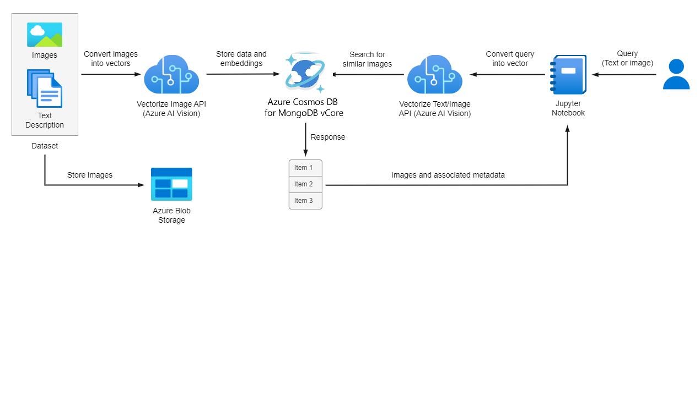

# Vector Search Code Samples

This directory includes notebooks designed to showcase the vector search capabilities on Azure Cosmos DB for Mongovcore. Before running these notebooks, ensure that you have set up your working environment and your Azure Cosmos DB for Mongo vcore collection as outlined in the [project description](../README.md).

The image similarity search workflow is summarized as follows:

1. Use the Vectorize Image API or the Vectorize Text API to generate vector embeddings of an image or text, respectively.
2. To calculate similarity and retrieve images, use the built-it vector operators of the Mongo vcore database.
3. Display the retrieved images using the `matplotlib` package.

## Exact Nearest Neighbor Search

In the *[image_search.ipynb](image_search.ipynb)* Jupyter Notebook, you will build a basic image similarity search application using the Azure AI Vision multi-modal embeddings APIs and Azure Cosmos DB for Mongo vcore. You will explore both text-to-image and image-to-image search approaches.

**More samples will be added soon!**
